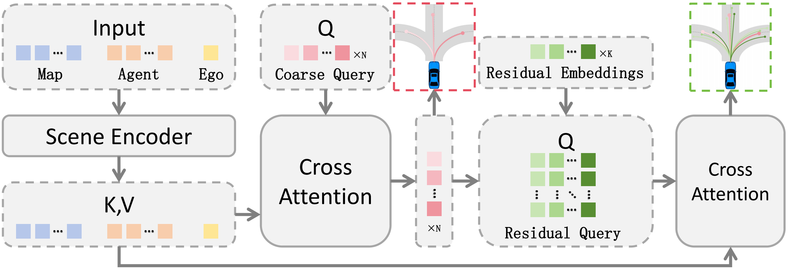
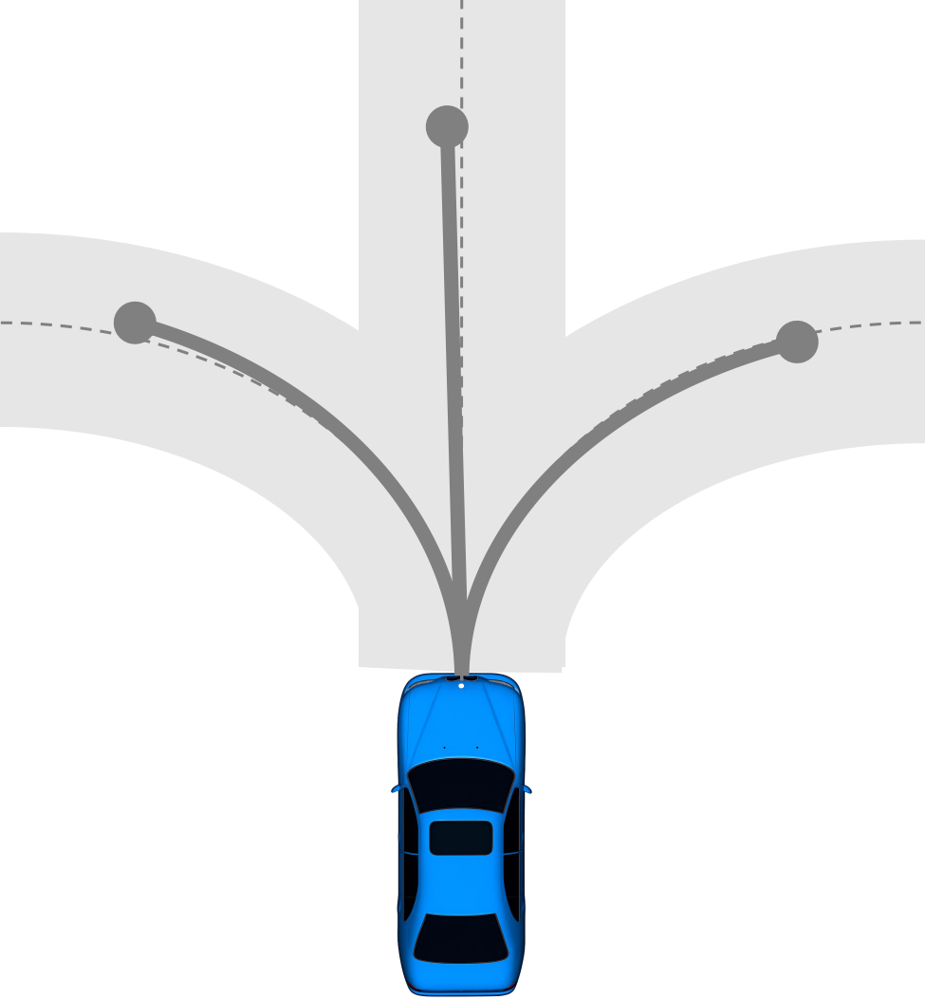
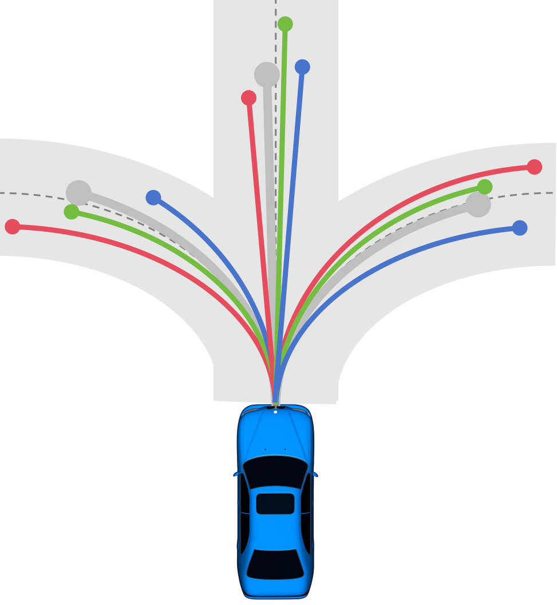

# HRTD: Hierarchical Residual Trajectory Decoding for Multi-Modal Autonomous Driving Planning

Official implementation of **HRTD (Hierarchical Residual Trajectory Decoding)** for multi-modal autonomous driving planning.

📄 Paper: *HRTD: Hierarchical Residual Trajectory Decoding for Multi-Modal Autonomous Driving Planning*  
📦 Code: [https://github.com/haonan-ai/HRTD](https://github.com/haonan-ai/HRTD)

---

## Overview

Autonomous driving systems require generating multiple feasible trajectories due to the inherent uncertainty in traffic scenarios. **HRTD** introduces a **hierarchical trajectory decoding** framework:

1. **Coarse trajectories** represent high-level behaviors (e.g., lane change, turning).
2. **Residual branches** refine these trajectories with fine-grained motion details.

This structure improves trajectory diversity, accuracy, and mode utilization.

<p align="center">

</p>

---

## Flat vs Hierarchical Trajectory Decoding

<p align="center">


</p>

**Flat Decoder**: Multiple trajectory heads predict complete trajectories independently, leading to redundancy.

**Hierarchical Decoder (HRTD)**: First predicts coarse trajectories, then refines them with residual branches for motion variations.

---

## Method

### Coarse Trajectory Generation
Coarse trajectories represent high-level behaviors, such as lane keeping, lane change, turning, or speed adjustment.

### Residual Refinement
Each coarse trajectory is refined using **K residual branches**, producing structured diversity in trajectories:

`Y_hat(i,j) = Y_hat_i^c + ΔY_hat(i,j)`

### Hierarchical Supervision
Training uses a two-stage matching strategy:
1. Match ground truth to the closest **coarse trajectory**.
2. Select the best **residual branch** within that group.

---

## Experiments

### nuPlan Val14 Results

| Method     | OLS ↑ | NR-CLS ↑ | R-CLS ↑ | minADE ↓ | minFDE ↓ |
|------------|-------|----------|---------|----------|----------|
| PLUTO-Flat | 89.8  | 90.7     | 76.5    | 0.83     | 1.56     |
| **HRTD**   | **90.2** | **91.3** | **77.8** | **0.80** | **1.48** |

HRTD improves trajectory accuracy, diversity, and mode utilization.

---

## Key Features

- Hierarchical trajectory decoding
- Residual trajectory refinement
- Improved trajectory diversity and mode utilization
- Compatible with **PLUTO-based planners**

---

## Acknowledgements

This project builds upon the [PLUTO planner](https://github.com/motional/pluto) and the [nuPlan benchmark](https://github.com/motional/nuplan-devkit).

---

## Setup Conda Environment

```bash
conda create -n pluto python=3.9
conda activate pluto

# Install nuplan-devkit
git clone https://github.com/motional/nuplan-devkit.git
pip install -e ./nuplan-devkit

pip install torch==2.0.1 torchvision==0.15.2 --index-url https://download.pytorch.org/whl/cu118
pip install natten==0.14.6 \
  -f https://shi-labs.com/natten/wheels/cu118/torch2.0.0/index.html \
  --trusted-host shi-labs.com
pip install -r ./requirements.txt
conda install -c conda-forge -y ffmpeg imageio-ffmpeg imageio
conda install -c conda-forge numpy==1.26.4 scipy
```

## Run Training

```bash
CUDA_VISIBLE_DEVICES=2,3 python run_training.py \
  py_func=train +training=train_pluto \
  worker=single_machine_thread_pool worker.max_workers=32 \
  scenario_filter=training_scenarios \
  data_loader.params.batch_size=128 \
  lr=1e-4 epochs=15 warmup_epochs=2 \
  model.num_modes=3 model.num_residual_modes=4
```

## Run Simulation

```bash
CKPT_ROOT="$(pwd)/checkpoints"
CHALLENGE="open_loop_boxes"

python run_simulation.py \
    +simulation=$CHALLENGE \
    planner=pluto_planner \
    scenario_builder=nuplan_mini \
    scenario_filter=mini_demo_scenario \
    planner.pluto_planner.planner_ckpt="$CKPT_ROOT/pluto.ckpt"
```